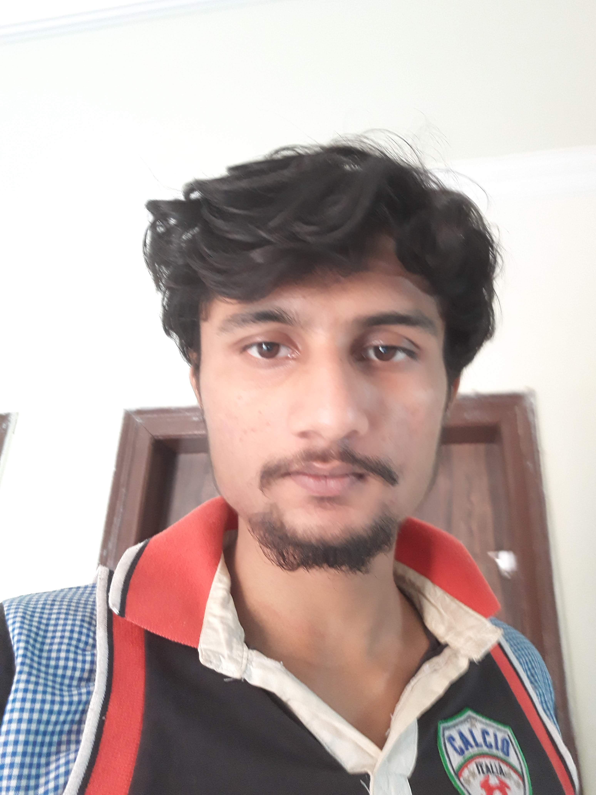

 

## About

I'm a researcher and data scientist working in natural language processing, computational social science, and cultural analytics. I'm interested in modeling how people communicate about their subjective experiences through text, especially when these communications occur in online communities centered on healthcare support or cultural objects like books or games. My research relies on unsupervised machine learning methods and re-explores the reliability and evaluation of these methods when applied to small, topic-focused datasets. 

My past work has examined how postpartum people frame their [birth experiences](https://maria-antoniak.github.io/resources/2019_cscw_birth_stories.pdf),  how people communicate their [pain levels](https://maria-antoniak.github.io/resources/2020_frontiers_pain.pdf) to physicians, and how the use of word embedding models require additional [stability tests](https://maria-antoniak.github.io/resources/2018_evaluating_stability.pdf) when used to measure biases.

I'm currently a working as a Data Scientist at HT Media Ltd. Currently, I work in Shine.com team which is India's second largest recruiting platform.  I have completed my B.Tech in Electrical and Electronics Engineering from Guru Gobind Singh Indraprastha University, New Delhi. 

Natural language processing, unsupervised machine learning, digital humanities, healthcare, computational social science.

 

---
layout: default
---

 
You can download a PDF of my CV [here](http://aman-sawarn.github.io/resources/aman_res.pdf).

 

<!-- ---

---
layout: default
---
 
## INDUSTRY EXPERIENCE

### HT Media Ltd. - Shine.com
#### Data Scientist  
Gurugram, Harayana, India  
October 2020 - Till Date 
* Worked on a SOTA CV Parser for shine.com
* Created a custom named entity recognition and normalization system for extracting various details from resume text.
* Used BERT for feature extractions followed by various LSTM, CNN architectures for finetuning models
* Implemented the NLP sections of a tensorflow learning pipeline for the core product.
* Implemented the NLP sections of a tensorflow prediction pipeline for the core product.
* Deployed CV Parser as In-House product and saved 0.01 $ per Job applies on shine.com.

### HT Media Ltd. - Shine.com
##### Data Science Intern
Gurugram, Harayana, India  
June 2020 - October 2020
* Worked on a SOTA CV Parser for shine.com
* Created a custom named entity recognition and normalization system for extracting various details from resume text.
* Constructed a Dataset which could be used as absolute benchmark for various applications related to NER.
* Implemented TFIDF and Bag of Words for text vectorizations.
* Created Ensemble Text Embeddings using GLoVE, Word2Vec and FastText for Text Embeddings. 
* Implemented a baseline model for SOTA CV Parser to be built In-House. 

### Toffee Insurance
##### Data Science Intern
Gurugram, Harayana, India  
June 2019 - August 2019
* Worked on a Fraud Detection model on Insurance Claims. 
* Created a model using Random Forests and XGBoost.
* Achieved an AUC score of 0.84 from previously 0.70 in predicting frauds.
* Cleaned Dataset discussing various domain specific details from various Product Managers.

 

## EDUCATION 

 

### Guru Gobind Singh Indraprastha University, New Delhi
B.Tech in Electrical and Electronics Engineering
August 2016 - June 2020

 

### University of Michigan
[Applied Machine Learning in Python](https://www.coursera.org/learn/python-machine-learning)
[Credentials](https://www.coursera.org/account/accomplishments/verify/F3XLLRXQ2E6Y) 
* Instructor: [Bernd Goehring](https://www.coursera.org/instructor/kevyn-ct)

### University of Michigan
[Python Data Structures](https://www.coursera.org/learn/python-data)
[Credentials](https://www.coursera.org/account/accomplishments/verify/U5J535AWPELN) 
* Instructor: [Charles Russell Severance](https://www.coursera.org/instructor/drchuck)

### University of Washington
[Machine Learning Foundations: A Case Study Approach](https://www.coursera.org/learn/ml-foundations)
[Credentials](https://www.coursera.org/account/accomplishments/verify/3SV2AB4U79F3) 
* Instructor: [Carlos Guestrin](https://www.coursera.org/instructor/guestrin)

### deeplearning.ai
[Improving Deep Neural Networks: Hyperparameter tuning, Regularization and Optimization](https://www.coursera.org/learn/deep-neural-network)
[Credentials](https://www.coursera.org/account/accomplishments/verify/7R7MPNFAMMRE) 
* Instructor: [Andrew Ng](https://www.coursera.org/instructor/andrewng)

 

---

## SKILLS

### Computer Languages

Python (primary), C++ (some experience)

### Python Stack

spaCy, Gensim, scikit-learn, pandas, SciPy, NumPy, Tensorflow, Keras

### Other Toolkits

Stanford CoreNLP, NLTK, openNLP, Seaborn, Matplotlib

### Human Languages

English ,  Hindi

 

---

## PUBLICATIONS

* To be updated soon- Currently under review*. 2020.

---

 

## OTHER ACADEMIC EXPERIENCE

* Took ML sessions for IEEE-MAIT local chapter  
 

 
  -->

   
